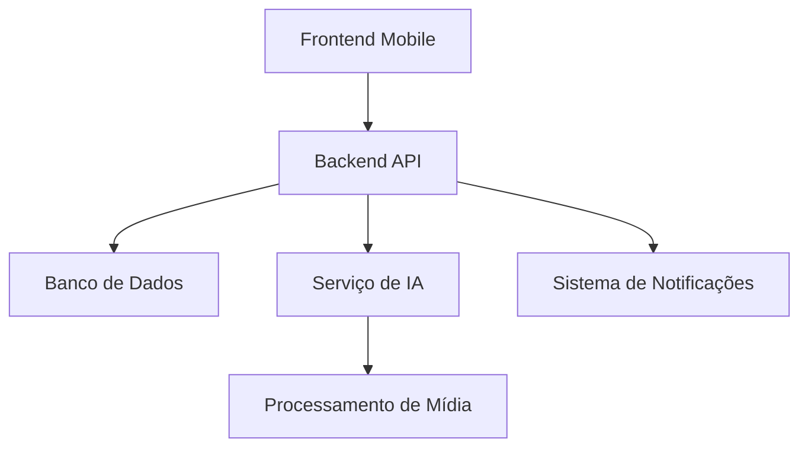

# 🚀 Renault Risk Management System - Projeto Aplicado SENAI


---

**Tecnologia Inteligente na Gestão de Riscos Industriais**  
*Solução completa para identificação, registro e prevenção de riscos na linha de produção*

---

## 📌 Visão Geral

Sistema integrado para gestão de riscos na indústria automotiva com:
- 📱 Aplicativo mobile para operadores
- 📊 Dashboard analítico para gestores
- 🧠 Módulo de IA para sugestão automática de soluções
- ⚡ Notificações em tempo real

[](https://opensource.org/licenses/MIT)


---
## [VIDEO] - Demonstrativo do APP
[](https://youtu.be/I1zNt1AEwpo)

## - PROJETO APLICADO I
[](https://youtu.be/6StBDyFVTvw)

## 🏗️ Arquitetura do Sistema



---

## 🧩 Componentes Principais

### 📱 Frontend (Mobile)
- **Tecnologias**: Angular 17 + Ionic 7 + Capacitor
- **Features**:
  - 🎤 Captura por voz
  - 📸 Upload de imagens/vídeos
  - 📍 Geolocalização de riscos
  - 🔄 Funcionamento offline

[](https://stackblitz.com/github/zevjr/senai-projeto-aplicado-I/tree/main/frontend)

### ⚙️ Backend
- **Tecnologias**: GoLang + Gin + GORM
- **APIs**:
  - `/api/riscos` - CRUD de registros
  - `/api/ia` - Integração com modelo de IA
  - `/ws` - WebSocket para notificações

```bash
# Rodar localmente
cd backend
go run main.go
```

### 🧠 Módulo de IA
- **Tecnologias**: Python + Langchain + OpenCV
- **Funcionalidades**:
  - 🔍 Análise de similaridade entre riscos
  - 🎙️ Transcrição de áudio (Whisper)
  - 🖼️ Detecção de padrões em imagens

### 🗃️ Banco de Dados
- PostgreSQL 15 (AWS RDS)
- Modelo principal:
```sql
CREATE TABLE riscos (
    id SERIAL PRIMARY KEY,
    local VARCHAR(255),
    criticidade INTEGER,
    descricao TEXT,
    midia_url VARCHAR(512),
    solucoes JSONB
);
```

---

## 🛠️ Como Executar

1. **Pré-requisitos**:
   - Node.js 18+
   - Go 1.22+
   - Python 3.11
   - Docker

2. **Setup inicial**:
```bash
git clone https://github.com/zevjr/senai-projeto-aplicado-I.git
cd senai-projeto-aplicado-I
make setup
```

3. **Variáveis de ambiente**:
Crie um arquivo `.env` baseado no `.env.example` em cada diretório.

---

## 📊 Protótipos e Documentação

Acesse nossos protótipos interativos:
- [Figma - Fluxo Operador](https://figma.com/link-prototype)
- [Figma - Dashboard Gerencial](https://figma.com/link-dashboard)

Documentação técnica completa:
- [Arquitetura do Sistema](docs/ARCHITECTURE.md)
- [Roadmap](docs/ROADMAP.md)

---

## 🤝 Como Contribuir

1. Faça um fork do projeto
2. Crie uma branch (`git checkout -b feature/nova-funcionalidade`)
3. Commit suas mudanças (`git commit -m 'Adiciona nova funcionalidade'`)
4. Push para a branch (`git push origin feature/nova-funcionalidade`)
5. Abra um Pull Request

[](https://codespaces.new/zevjr/senai-projeto-aplicado-I)

---

## 📜 Licença

Distribuído sob licença MIT. Veja `LICENSE` para mais informações.

---

## ✉️ Contato

Equipe de Desenvolvimento:
- Alan Silva - [@alan](https://github.com/silva-d-alan)
- Gabriel Santos - [@gabriel](https://github.com/GabrielCarvalhu)
- José Vieira - [@zevjr](https://github.com/zevjr)
- Leandro Silva - [@leandro](https://github.com/Leandro-Michail-Krikis)
- Elisana Salvador - [@elisana](https://github.com/ElisanaSalvador)

Projeto desenvolvido como parte do curso de **Análise e Desenvolvimento de Sistemas** no [SENAI/SC](https://www.sc.senai.br/).
